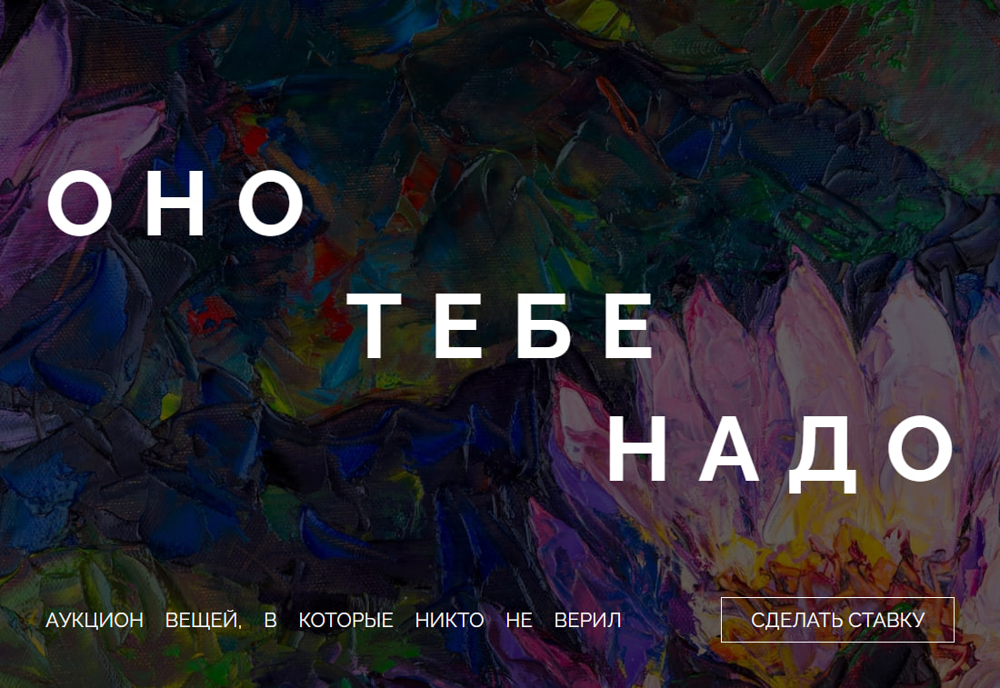

# Оно тебе надо

Лендинг аукциона вещей, в которые никто не верил. Одностраничный сайт с семантической вёрсткой, CSS Grid и Flexbox раскладками, переиспользуемыми компонентами и методом прогрессивного джипега.

  

## Демо

**[https://vovchensky.github.io/ono-tebe-nado-fd/](https://vovchensky.github.io/ono-tebe-nado-fd/)**

## Технологии

- HTML5 (семантическая разметка)
- CSS3 (Grid, Flexbox, позиционирование)
- Шрифты через `@font-face`
- Pixel Perfect вёрстка
- Переиспользуемые CSS-компоненты (оверлей, адресный блок)
